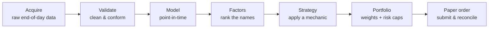
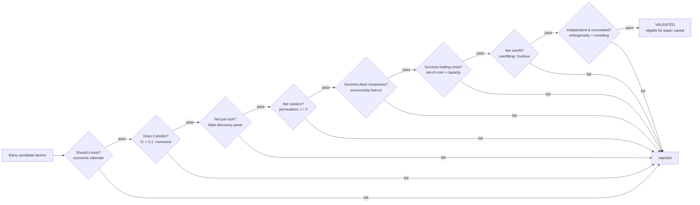

# Disciplined Risk-Premium Harvesting for the Sole Trader

### Telling Edge from Luck

*A whitepaper on the business problem Strawberry Labs solves, and the mathematics it uses to solve it.*

---

> **About this paper.** It is written for a *potential user* — someone who understands markets and risk but is not steeped in quantitative statistics. It is deliberately technology-light: you will meet the business problem and the reasoning behind every decision the platform makes, but no code, no vendor names, and no jargon left unexplained. Where the platform uses a number — a hurdle, a threshold, a measured discount — this paper shows you the actual number and tells you which piece of published research it came from.
>
> The single most important thing to understand before reading further: **this platform's value is not speed, secrecy, or cleverness. Its value is discipline** — a refusal to let a trading signal reach real money until it has survived a gauntlet of statistical tests that the academic literature designed specifically to catch signals that only *look* good.

---

## 1. Executive summary

Strawberry Labs is a **sole-trader, nightly, multi-asset risk-premium harvester**. In plain terms: it is a system for one person to systematically capture the persistent returns that markets pay for bearing certain risks — run once each evening on end-of-day data, starting with stocks and expanding deliberately outward.

What makes it different is not what it trades but what it *refuses* to trade. Most people operating at this scale lose money not because they lack ideas, but because they cannot tell a real edge from a lucky accident — and they bet real capital on the accident. Strawberry Labs is built, end to end, as an **evidence funnel** whose entire job is to make that mistake structurally difficult.

The platform is honest about where it stands, and you should hold it to that:

- **Mature on equities.** The data pipeline, factor research, validation gates, risk model, portfolio construction, and operator dashboard all work and are exercised in production for stocks.
- **Phase-0 MVP available July 1, 2026** — one strategy walked the entire path on corrected evidence, trading in a **paper account only** (real broker fills, no real money).
- **Phase 1 completes the funnel and broadens the surface (paper).** By the end of Phase 1 the validation gauntlet is *complete* — a causal-rationale front gate, decile monotonicity, factor independence, and a crowding check join the statistical core (§5.7) — at least **three** strategies have walked it, and ETF rotation, event capture, and a long/short experiment all trade in paper.
- **First strategy goes live October 1, 2026** — the proven momentum strategy crosses from paper into real capital after it earns the right (see §7).
- **Expanding deliberately thereafter** into ETFs, events, futures, commodities, and crypto — with several strategy classes excluded *forever, by design*.

Those three dates — **July 1 paper, October 1 live, deliberate expansion after** — are the headline to remember.

This paper is for one kind of reader: a single operator who wants to harvest durable risk premia at a daily-or-slower cadence, and who values a system that will tell them *no*. It is explicitly **not** for high-frequency traders, statistical-arbitrage shops, or anyone whose edge depends on speed or information no individual can obtain.

---

## 2. The business problem

### Why most people at this scale lose

A single operator competing in public markets faces four structural disadvantages that no amount of effort or code can erase:

1. **Latency** — institutions act in microseconds; you act the next morning.
2. **Capital scale** — meaningful diversification across some strategies requires far more capital than one person has.
3. **Market access** — prime brokerage, securities lending, expert networks, and the ability to act as an authorized participant are institutional plumbing you cannot replicate.
4. **Attention** — you are one person running everything; strategies that need constant monitoring will eventually be monitored badly.

**The rule that follows is simple: any strategy whose edge depends on out-running these disadvantages is a losing fight.** That single principle eliminates most of what people *think* of as "quant trading" — and eliminating it is the first act of discipline.

### The one edge that survives

There are only two sources of trading edge in existence:

| Edge | What it is | Fit for one operator |
|---|---|---|
| **Risk premium** | Persistent compensation for bearing a systematic risk or exploiting a durable behavioral pattern | **Strong** — survives at one-person attention and capital scale |
| **Market inefficiency** | Fleeting mispricing from events, microstructure, sentiment, or positioning | **Poor** — fast-decaying, and fights every disadvantage above |

Strawberry Labs is, by deliberate design, a **risk-premium harvester**. It pursues returns that exist because they compensate someone for a real risk — and which therefore persist long enough for a person checking the market once a day to capture them. The inefficiency track is not deferred; it is *excluded* (see §3).

That risk premia exist, and persist, is not folklore. It is the central finding of decades of financial economics — from the Capital Asset Pricing Model of the 1960s, through Fama and French's three-factor model (1992), to the momentum effect documented by Jegadeesh and Titman (1993). The engine that turns a small edge into real performance is captured in one relationship, the **Fundamental Law of Active Management** (Grinold; Grinold and Kahn):

> **Performance ≈ skill × √breadth** — a tiny predictive edge, applied across many independent bets, compounds into a meaningful result.

This is precisely why a *cross-sectional, many-names, nightly* approach is the right shape for a sole trader: you do not need to be very right about any one stock; you need to be slightly right across hundreds of them, repeatedly.

### The silent killer: overfitting

Here is the danger that actually destroys retail capital. Test enough ideas against historical data and — by pure chance — one of them will look brilliant. Deploy it, and it reverts to noise, taking your money with it. The more ideas you try, the *more certain* it becomes that your best-looking result is a fluke.

A sole trader's capital cannot survive this. So the platform's central, non-negotiable job is to **distinguish a genuine edge from a lucky one** — and to do so with enough statistical force that the answer can be trusted. Sections 5 is devoted entirely to how it does this.

There is even an unflattering twist for *real* edges: McLean and Pontiff (2016) showed that once a predictive pattern is published, its returns fall roughly 26% out of sample and 58% after publication — worst for the very strategies that looked best in the backtest. So the platform treats *every* backtest as optimistic and discounts it before trusting it. Honesty is not a posture here; it is a risk control.

### The counterintuitive advantage: capacity inversion

One disadvantage cuts the *other* way. The smallest, least-liquid stocks — microcaps — are a place institutions **cannot** go: a multi-billion-dollar fund cannot deploy meaningful size into a tiny company without moving the price against itself. That habitat is therefore the **structural advantage of being small**. A sole trader can harvest risk premia in names that are simply off-limits to large players. This does not reverse the rule above — the excluded strategy classes stay excluded — but it reframes microcap from "too risky to touch" into "your home turf."

---

## 3. The operating model and its deliberate boundaries

Every design decision in Strawberry Labs flows from one frame: **a single human operator, making one decision per day.** Concretely:

- A **nightly cycle** that produces a target portfolio from end-of-day data.
- **One price source per instrument** — no cross-venue plumbing.
- **Daily-or-slower** decisions — signals that decay over weeks-to-months, not minutes.
- **Manual or simple-bridge order placement** the next morning — no autonomous 24/7 execution stack.
- **No external clients, no regulatory reporting** — you are the only investor.

These are not gaps. They are **seven deliberate design choices**, and presenting them as features is the point:

| # | Design choice | Why it fits one operator |
|---|---|---|
| 1 | Nightly end-of-day cadence | One human, one predictable decision window |
| 2 | Single price source per instrument | No multi-venue complexity; matches a single account |
| 3 | Slow, statistically rigorous validation | Sole-trader capital cannot survive overfitting |
| 4 | Long-horizon factor & strategy lifecycle | No incentive to chase fast-decay edges that need babysitting |
| 5 | Cross-sectional ranking as the test of merit | The right framework for the risk-premium strategies in scope |
| 6 | Manual / simple-bridge order placement | Avoids the cost and risk of a 24/7 order-management system |
| 7 | No external client or regulatory surface | Removes ~30% of the institutional surface that simply does not apply |

### The negative space — what is deliberately never built

A platform's discipline is most visible in what it refuses to attempt. The following are **out of scope permanently**, because each fights a sole-trader disadvantage that no code can close:

- **Intraday, tick, and microstructure trading** — conflicts with the nightly cadence; institutional latency wins every contest.
- **Cross-venue and dual-listing arbitrage** — requires a multi-venue execution stack.
- **Statistical arbitrage** (pairs, cointegrated baskets) — a decayed strategy class whose realistic net return after costs and borrow is approximately zero at retail scale.
- **Merger and event arbitrage** — needs a legal / expert-network informational edge an individual does not have.
- **High-frequency and latency-sensitive execution** — uneconomical for one person.
- **Multi-strategy formal capital allocators, compliance, and client reporting** — institutional overhead irrelevant to a single operator.

The message is not "we haven't gotten to these yet." It is "**chasing these would be a mistake, and refusing them is part of the value.**" A sharp tool that does one thing well beats a generic one that does many things badly.

---

## 4. The pipeline as an operational flow

What actually happens each night, between raw market data and a target portfolio? The platform is best understood as a **repeatable assembly line** with a single identity stamped on each night's run, so everything that happens is traceable and reproducible.

*Diagram A — the Nightly Assembly Line. One run identity end-to-end; one nightly decision window; no look-ahead.*

The three data stages, in business terms:

- **Acquire.** Ingest exact vendor data and preserve it untouched. Every fetch — including every *failure* — is recorded, so the platform can always answer "what did we actually receive, and when?"
- **Validate & conform.** Clean and type the data, remove duplicates, and restrict it to an investable universe (excluding, for example, instruments too illiquid or structurally unsuitable to trade).
- **Model.** Assemble an analytics layer designed so that **on any historical date, you see only what you could have known on that date** — never the future. This *point-in-time integrity* is the bedrock of trust: a backtest that accidentally peeks at future data is worthless, and most of the ways amateurs fool themselves trace back to exactly this leak.

From there, the research-to-order spine runs: **Factor → Strategy → Portfolio → Order.** A *factor* is a measurable property used to rank stocks; a *strategy* applies a mechanic (e.g. "buy the top-ranked, hold a month") to a validated factor; *portfolio construction* turns rankings into position sizes; and the final stage turns those into orders.

> **▶ Running example — the 12-1 momentum factor.**
> Throughout this paper we follow one real factor: **12-1 momentum** — *rank every stock by its return over the past twelve months, skipping the most recent month* (the skip avoids short-term reversal noise). Intuitively: "buy what has been winning over the past year, ignoring last month's wobble."
>
> On the assembly line, each night the platform computes this factor point-in-time for every name in the investable universe and stores the ranking. No claim has been made yet that it *works* — that is precisely the question Section 5 exists to answer. At this stage, 12-1 momentum is just a candidate.

---

## 5. The mathematics of trust

This is the heart of the platform and the heart of this paper. Each subsection below answers one business question, explains the concept in plain language, shows the platform's actual number, and names the published research that the hurdle comes from. The recurring message: **Strawberry Labs did not invent its standards — it adopted the literature's, and in one important case adopted a standard the literature explicitly recommended that most practitioners ignore.**[^numbers]

Picture the whole section as a **funnel**. Many candidate factors enter at the top. Each gate rejects some. Only a few survive to become eligible for real (paper) capital.

*Diagram B — the Evidence Funnel. Wide at the top, narrow at the bottom; most ideas are rejected, by design. The two outer gates — "should it exist?" at the front and "independent &amp; uncrowded?" at the back — are the validation-completeness gates Phase 1 adds (§5.7); the six in the middle are the statistical core already in production.*

### 5.1 Does this signal actually predict? — the Information Coefficient

**Business question:** *Does ranking stocks by this factor tell me anything about which ones will go up?*

The **Information Coefficient (IC)** measures exactly this: it is the correlation between how a factor ranks stocks *today* and how those stocks actually perform *later*. A perfect crystal ball would score 1.0; pure noise scores 0.0. Real, useful financial factors live in a humble range — an IC of even 0.05 sustained across hundreds of names is valuable, because of the breadth multiplier from the Fundamental Law (§2). The platform measures IC as a rank correlation (so a few extreme stocks cannot dominate) and combines it across multiple holding horizons.

The platform's promotion hurdle is an **information ratio** (the IC's consistency-adjusted strength) with absolute value **above 0.2**.

*Grounded in:* Grinold and Kahn's **Fundamental Law of Active Management** — the formal reason a small but consistent IC, applied across breadth, is a genuine edge rather than a rounding error.

### 5.2 Did I just get lucky across many guesses? — multiple-testing correction

**Business question:** *I tested dozens of factors. Doesn't testing many guarantee that one looks good by accident?*

Yes — and this is where most retail quant quietly dies. If you test 50 unrelated factors, you should *expect* a couple to clear a normal "95% confidence" bar (a *t*-statistic above 2.0) purely by chance. The conventional threshold is far too lenient when many ideas are in flight.

The platform raises the bar to a *t*-statistic **above 3.0** (roughly a 0.3% chance of being a fluke, versus 5% at the conventional bar), and additionally applies a **false-discovery correction** across the whole panel of factors tested together.

This has a stark, honest consequence worth showing in full. The platform tests "not random" by shuffling the data many times (see §5.3). A cheap *nightly* check uses 100 shuffles — but with only 100 shuffles, the best possible result is a p-value of about **0.0099**, which **can never** clear the strict 0.0027 bar. So a serious promotion decision requires a *deep* run of around **5,000 shuffles** (best possible p-value ≈ 0.0002). The platform is candid about this: **nightly runs are monitoring; promotion is a deliberate deep-research decision.**

*Grounded in:* **Harvey, Liu and Zhu (2016)** — who, surveying hundreds of published factors, concluded the conventional *t* > 2.0 hurdle is far too lenient and recommended **t > 3.0**. The platform adopts that recommendation verbatim. Reinforced by **Harvey and Liu (2020)** on false-and-missed discoveries; **Benjamini and Yekutieli (2001)** for the dependence-robust false-discovery correction (factor results are heavily correlated, so a naïve correction under-controls); and **Feng, Giglio and Xiu (2020), "Taming the Factor Zoo"** — most candidate factors add nothing beyond the ones you already have.

### 5.3 Could pure randomness have produced this? — permutation testing

**Business question:** *How do I know this result isn't just a pattern I'd see in random data?*

The cleanest way to answer is to *manufacture* randomness and compare. The platform repeatedly **shuffles** the factor's values — thousands of times — destroying any genuine relationship while preserving the data's overall shape, and records how good a result *random* data produces. It then asks: where does the *real* result fall in that distribution of luck? If the real result is far out in the tail, randomness is an implausible explanation. If it sits in the crowd, the factor is noise.

*Grounded in:* a coherent suite of **permutation and randomization tests** (the "Masters methods" — Monte-Carlo permutation testing, combinatorial cross-validation, selection-bias correction, return and drawdown confidence bounds, family-wise error control, and confirming-superiority tests), adopted as a methodology with reference implementations ported for numerical fidelity. The conceptual lineage runs back to White's (2000) Reality Check for data-snooping.

### 5.4 Are dead companies flattering my backtest? — survivorship bias

**Business question:** *My historical data is full of companies that still exist. What about the ones that went bankrupt and vanished?*

This is a subtle, expensive trap. If your historical universe only contains companies that *survived* to today, your backtest is quietly cheating: it never had to live through the bankruptcies, delistings, and wipeouts that real money would have suffered. Worse, the academic literature shows the danger is not mainly in inflated *returns* — it is in inflated **predictability**: survival-filtering manufactures the *appearance* of a working signal where none exists.

Strawberry Labs measures this directly. It splices **4,858 delisted companies** back into history — assigning realistic terminal losses to names that went to zero — and re-runs the evidence. The measured damage to the platform's central momentum factor was an information-ratio gap of about **−0.035**. The validation gate now **subtracts** this haircut rather than pretending dead companies never existed.

*Grounded in:* **Brown, Goetzmann, Ibbotson and Ross (1992)** — survival-truncation manufactures false persistence; **Shumway (1997)** and **Shumway and Warther (1999)** — the canonical delisting-loss constants (roughly −30% for NYSE/AMEX, −55% for Nasdaq) and the finding that correcting for this can make an apparent "size premium" vanish entirely; **Carhart, Carpenter, Lynch and Musto (2002)** — the bias grows with sample length; **Beaver, McNichols and Price (2007)** — the bias is anomaly-specific in sign.

### 5.5 Does the edge survive trading costs? — net-of-cost reality

**Business question:** *Fine, the signal predicts. But after I pay to trade it, is there anything left?*

A great many "edges" are real on paper and dead after costs. The platform estimates the **bid-ask spread** for every name directly from its daily price range, applies a broker-realistic cost model, and reports performance **net of costs**. In one real paper run, the gap between the gross backtest and the net reality — the **cost drag** — was about **650 basis points** (6.5%). It then asks a second question institutions cannot ignore but a sole trader sometimes can exploit: **capacity** — how much capital can actually be deployed into a name before the trade itself moves the price.

The blunt lesson from the literature is worth stating plainly: **statistical significance is not a tradeable edge.** A factor can pass every test above and still be economically dead once you pay the spread.

*Grounded in:* **Corwin and Schultz (2012)** — the daily high-low spread estimator the platform implements; **Novy-Marx and Velikov (2016)** — net returns collapse for higher-turnover anomalies, motivating a turnover ceiling; **Chen and Velikov (2023)** — the average anomaly earns only ≈ 4 basis points per month *net*; **Perold (1988)** — the implementation-shortfall framework; with **Abdi and Ranaldo (2017)** and **Frazzini, Israel and Moskowitz (2015)** as cross-checks.

### 5.6 Am I fooling myself by tuning? — overfitting probability

**Business question:** *I tried many variations and kept the best one. Isn't "the best of many tries" itself a form of cheating?*

It is — and it is the most seductive form. The platform quantifies it. It computes a **Probability of Backtest Overfitting**: across many splits of the data, how often does the configuration that looked best in one half fail to be best in the other half? A high probability means you were tuning to noise. It also **deflates** reported performance by the *number of trials* you ran — a strategy chosen from 1,000 attempts must clear a far higher bar than one tested once. Finally, it reserves a **lockbox**: a slice of out-of-sample data the search process structurally *cannot* see, so its result is an honest confirmation rather than a contaminated one.

*Grounded in:* **Bailey and López de Prado (2014)** — the Deflated Sharpe Ratio, which deflates by the number of trials; **Bailey, Borwein, López de Prado and Zhu** — Probability of Backtest Overfitting via combinatorially-symmetric cross-validation; **López de Prado (2018), *Advances in Financial Machine Learning*** — purged cross-validation with an embargo, so the "out-of-sample" test isn't quietly leaking through overlapping data.

### 5.7 Completing the funnel — the four gates Phase 1 adds

The six gates above are the platform's statistical core, in production today. They answer, with literature-grade force, *"is this pattern real?"* But a pattern can be real and still not deserve real money — and the institutional factor-validation playbook closes that gap with four more checks. **Phase 1 adds all four**, two wrapping the front of the funnel and two the back, so that by Phase-1-complete the funnel asks not only *"is it real?"* but *"should it exist, is it smooth, is it new, and is it crowded?"*

**Should this signal even exist? — the economic-rationale gate.** This is the front gate, and conceptually the most important. Every statistical test answers *"is the pattern real?"*; none answers *"should it be there at all?"* If you test enough patterns, some will clear even the strict bars above by sheer luck — so before any statistics, the platform now asks for a **causal story**: is the edge a payment for bearing a risk, a durable behavioral mistake, or a structural feature of the market? A factor with no plausible mechanism — the textbook example is *"stocks whose ticker begins with A outperform"* — is refused regardless of how good its backtest looks. The platform already imposes *more* multiple-testing rigor than most institutions; this gate adds the one thing it lacked — a **causal-prior filter** — so a story-less factor faces a higher bar rather than the same one.

**Is the relationship smooth? — decile monotonicity.** Sort the universe into ten buckets by the factor. A genuine risk premium should climb roughly **monotonically** from the bottom bucket to the top — not earn all its apparent edge from a single freak decile. A jagged, one-bucket pattern is usually a mechanical artifact, and this gate catches it even when the headline statistics look significant.

**Is it just a known factor in disguise? — neutralization / independence.** Many "new" factors are simply value, size, or momentum wearing a different name. The platform regresses a candidate against the factors it has *already* validated; if the edge evaporates once those are controlled for, the factor adds nothing and is rejected. Only a factor that earns its slot — that carries information beyond the existing book — passes.

**Is the trade already crowded? — crowding.** This is the back gate and a primary *ruin* risk for a risk-premium harvester. When too much capital chases the same factor, forward returns compress and the position becomes vulnerable to a coordinated, violent unwind — the 2007 "quant quake" and the 2009 momentum crash are the canonical examples. The platform scores crowding from **ownership concentration** (how tightly held the factor's favored names are) and the **valuation spread** between its long and short legs (a rich long leg means the trade is expensive and popular). A heavily crowded factor is flagged for watch — surfaced honestly, never silently traded.

*Grounded in:* **Harvey, Liu and Zhu (2016)** again — their framework treats the *prior* probability a factor is real as a first-class input, which is exactly the economic-rationale gate; **Patton and Timmermann (2010), "Monotonicity in Asset Returns"** — the formal test that returns climb across sorted buckets rather than concentrating in the extreme; **Feng, Giglio and Xiu (2020), "Taming the Factor Zoo"** — the canonical test of whether a new factor adds anything beyond the existing set; and on crowding, **Lou and Polk's "Comomentum"**, **Khandani and Lo (2007), "What Happened to the Quants in August 2007?"**, and **Arnott, Beck, Kalesnik and West (2016), "How Can Smart Beta Go Horribly Wrong?"** — valuation spreads as a leading indicator of crowded, return-poor factors.

### 5.8 The verdict, made honest

These gates do not operate in isolation; they **stack into a single corrected verdict**, and that verdict governs two parallel lifecycles:

- A **factor lifecycle**: *experimental → validated → deprecated*.
- A **strategy lifecycle**: *incubating → paper → live*.

The two are joined by one hard rule: **a strategy cannot advance unless the factor beneath it is `validated`.** You cannot trade on a signal that hasn't earned trust.

And here is the platform's discipline made visible in its own operations: under this corrected, literature-grade gate, **no factor can be promoted on a cheap nightly check.** Promotion is deliberately a deep-research-run decision; nightly evidence is for monitoring only. A lesser system would quietly lower the bar to make promotions happen on schedule. This one tells you the bar is high and that clearing it takes real work.

> **▶ Running example — 12-1 momentum down the funnel (real numbers).**
> Watch the candidate from §4 pass through each gate:
>
> | Gate | Question | 12-1 momentum result | Verdict |
> |---|---|---|---|
> | 5.1 | Does it predict? | Corrected information ratio ≈ **0.49** (hurdle 0.2) | ✅ pass |
> | 5.2 | Survives the false-discovery panel? | Dependence-robust adjusted p ≈ **0.008** | ✅ pass |
> | 5.3 | Not random, under the *strict* hurdle? | *Nightly* (100 shuffles) p ≈ **0.0099** — cannot clear 0.0027 | ❌ fail on nightly |
> | 5.3 | Re-run *deep* | Research run (≈ 500+ shuffles) p ≈ **0.0020** | ✅ clears t > 3.0 |
> | 5.4–5.6 | Survives dead companies, costs, overfitting? | Survivorship haircut applied; cost drag measured (§6) | ✅ |
>
> **Result: validated on deep evidence, not on a nightly shortcut.** This is the honest "monitoring vs. decision" split, demonstrated live on the platform's own flagship factor. The same factor now carries forward into Section 6 — where it becomes a strategy and meets real trading costs.

---

## 6. From a validated signal to a real (paper) order

A validated factor is still just knowledge. Turning it into orders — safely — is the job of the final stages.

- **Portfolio construction.** The platform turns rankings into position sizes and builds the book **compliant by construction**: limits on individual position size, sector concentration, and overall leverage are baked into the weights *before* any order exists. The portfolio is born within its risk limits rather than being clipped into them afterward.
- **The execution loop (paper).** Weights become whole-share orders, which are submitted to an interactive-broker **paper account** — real fills at the real market open, not a simulator. Positions are marked daily, and a **next-day reconciliation** checks the platform's internal record against the broker's, catching any discrepancy immediately.
- **A final safety rail.** Between "decide" and "submit," a **fail-closed guard** re-checks the intended book against its risk caps. If anything breaches a limit, the *entire* submission is rejected — no partial, no override. Safety defaults to *stop*.

### The honest boundary, phased — not "never"

The loop runs **paper-only through Phases 0 and 1** (July 1 – September 2026): real broker fills, no real money — *by deliberate decision, until the evidence earns the next step.* The lifecycle gate only enforces after a **≥ 63 market-day** attributed paper soak. When that soak completes — around **October 1, 2026** — the proven MVP strategy becomes the **first to trade live.** Live execution is therefore not "out of scope forever"; it is **gated behind survived paper evidence.** That is the entire honesty argument of this paper, restated as a date.

*Grounded in:* **Perold (1988)** — the gap between a paper portfolio (filled at the decision price) and a real one is a measurable quantity (implementation shortfall), which the platform's next-open-fill-versus-backtest-close comparison directly captures; and **McLean and Pontiff (2016)** — the reason the paper-tracking gate compares realized results to a *decay-haircut* of the backtest, not the raw backtest. A real edge is expected to fade, so the honest bar is beating a *discounted* expectation.

> **▶ Running example — 12-1 momentum reaches real capital.**
> The validated factor becomes a registered strategy, is promoted to **paper**, and is bound to the live paper book — the platform's actual MVP path. Its honest cost footnote: a real paper run measured a cost drag of about **650 basis points**, the visible difference between the gross backtest and the net-of-cost reality. The factor that *looked* strong in §5 is still strong after costs — but now you have *seen* the discount applied, not assumed it away.
>
> The last beat is the deliberate, *dated* stop sign: 12-1 momentum trades in **paper only** through the summer, accruing attributed evidence toward the ≥ 63-market-day soak — and on **October 1, 2026** becomes the platform's **first live (real-money) strategy.** The running example ends exactly where real capital begins.

---

## 7. The capability landscape and roadmap

### What works today

For equities, the full chain is mature and in production: data acquisition, curation, and modeling; factor engineering and the validation gates of Section 5; a factor-risk model; portfolio construction; the paper-execution loop; and an operator dashboard that surfaces every run. The platform is honest about its **partial** areas too — event capture, data lineage, capacity consumption, and off-site backup are works in progress, not finished.

### The capability map

The platform is organized into eight **capability bands**. The map below is the business-level view — what each band provides and where it stands when **Phase 1 is complete**. (A live, interactive version is built into the operator dashboard.)

| Band | What it provides | State at Phase-1 complete |
|---|---|---|
| **Knowledge & Data** | Acquire, clean, and model end-of-day data point-in-time | Mature for equities; **ETF universe** and **event capture** (earnings, index reconstitution, corporate actions) added |
| **Research & Discovery** | Factor engineering and the validation gauntlet of §5 | Mature; the funnel is **completed** — economic-rationale, monotonicity, independence, and crowding gates join the statistical core |
| **Portfolio & Risk** | Position sizing, the equity risk model, pre-trade caps, the cost model | Mature; **backtest-path risk caps** and **capacity-aware sizing** added |
| **Backtest & Attribution** | Historical simulation, tearsheets, attribution | Mature backtest; **performance attribution** (what drove the P&L) added |
| **Lifecycle & Universe** | The factor and strategy lifecycles, universe management | Mature; the research universe is **re-baselined** and **≥ 3 strategies** have walked the full funnel |
| **Execution** | The paper-trading loop, broker bridge, daily reconciliation | In service (paper); the first strategy crosses to **live** around the end of Phase 1 |
| **Platform Plumbing** | Orchestration, telemetry, backup, remote operation | Mature core; **off-site backup** and **remote operator access** added |
| **Human Surfaces** | The operator dashboard, domain governance, run analysis | Complete |

> The discipline of the map is its **negative space**: three bands an institution would fill — a formal multi-strategy capital allocator, compliance / regulatory reporting, and client / investor reporting — are **deliberately empty**, because a sole trader does not need them (§3).

### The phase timeline

The three milestones below are the concrete plan:

| Phase | When | What | Trading mode |
|---|---|---|---|
| **Phase 0 — MVP** | **available July 1, 2026** | One strategy (12-1 momentum) walked end-to-end on corrected, cost-aware, survivorship-adjusted evidence; the equity factor set | **Paper only** |
| **Phase 1 — Stabilize** | **July – September 2026** | Make the funnel repeatable (≥ 2 more strategies), ETF rotation, event capture, time-series momentum, a long/short experiment | **Paper only** |
| **First live strategy** | **October 1, 2026** | The proven Phase-0 momentum strategy crosses from paper to **live (real-money)** trading — the first time the loop touches real capital | **Live** |

**Why October 1 is not arbitrary.** The Phase-0 gate enforces only after a **≥ 63 market-day** attributed paper soak. Starting July 1, roughly 63 trading days elapse around **October 1** — so the go-live date is *the soak completing*, not a calendar pick. The strategy earns live capital by surviving three months of real paper fills.

### Phase 1 — what gets built (directional)

Phase 1 begins the moment Phase 0 is feature-complete and runs *in parallel* with the paper soak. Its theme is **stabilize the lifecycle in paper** — turn the one-strategy MVP into a repeatable funnel and broaden the surface, while only the single proven strategy ever touches real money. The items below are **directional, not date-committed**:

- **Complete the validation funnel.** Add the four gates of §5.7 — economic rationale, monotonicity, independence, and crowding — plus enforcement of the out-of-sample *lockbox* and the *capacity floor* the platform already measures. *Why: these close the gap between what the platform measures and what it actually decides on.*
- **Make the funnel repeatable.** Promote **≥ 2 more strategies** through the same corrected gate → paper → bind path, so the MVP becomes a process, not a one-off.
- **A long/short experiment.** Trade a dollar-neutral long/short book in paper with market-neutral risk caps — the first portfolio shape beyond long-only.
- **ETF universe.** The cheapest high-leverage unlock: lift one exclusion and re-validate factors on a wider universe, opening sector and country rotation.
- **Event capture.** Index reconstitution, an M&A calendar, and macro releases — a multiplier that sharpens equity research now and seeds later asset classes.
- **The sweep engine.** A disciplined parameter- and universe-search with a built-in overfitting budget, so exploration cannot quietly become curve-fitting.
- **Performance attribution and capacity.** Decompose realized paper P&L into factor, sector, and selection contributions, and turn the measured per-name capacity into a deployment ceiling.
- **Operational resilience.** Off-site, restore-tested backup of the whole program state, and remote operation of the box — the cheap ruin-risk hedges a sole trader should never skip.

Throughout Phase 1, **all new work stays in paper**; the only thing that goes live is the single Phase-0 MVP strategy that earned it.

### The expansion waves (beyond Phase 1)

Three principles drive the order: **cheapest unlocks first, multipliers before the things they multiply, and the multi-asset risk model last** (a cross-asset risk model with no cross-asset data is shelfware).

- **Quick wins** — the ETF universe (the cheapest, highest-leverage unlock: lift one exclusion and re-validate on a wider universe) and event capture (earnings, index reconstitution, corporate actions).
- **Foundational expansions** — asset-agnostic mechanics (time-series momentum, carry) and futures with continuous-contract rolls (the first genuinely new asset class).
- **Breadth and integration** — commodities, crypto spot and perpetuals, and finally a multi-asset risk model that ties them together.

### Strategy viability — what to pursue, and what to avoid

This table is the single most important strategic picture: it shows both what is reachable and what is deliberately off the board.

| Strategy family | Status | Phase / availability | Asset class |
|---|---|---|---|
| Cross-sectional momentum (12-1, residual) | ✅ MVP — goes live | **Phase 0** — paper Jul 1; **first live Oct 1, 2026** | Equities |
| Quality / value (fundamental) | ✅ Shipping | **Phase 0** — paper Jul 1, 2026 | Equities |
| Low-volatility / defensive | ✅ Shipping | **Phase 0** — paper Jul 1, 2026 | Equities |
| Cross-sectional reversal (5-day) | ✅ Ship now | **Phase 1** — new factor (Jul – Sep) | Equities |
| Sector / country rotation | ⚠️ Near | **Phase 1** — Jul – Sep (lift ETF exclusion) | ETFs |
| Earnings reversal · index-reconstitution drift | ⚠️ Near | **Phase 1** — Jul – Sep (event capture) | Equities |
| Time-series momentum (trend) | ⚠️ One sprint | **Phase 1** — Jul – Sep (new mechanic) | Equities, ETFs |
| Managed-futures trend · carry | ⚠️ One quarter | **Wave 2 – 3** (aspirational, post-Phase-1) | Futures, commodities, crypto |
| Stat-arb · merger-arb · HFT · microstructure | ⛔ Never | Out of scope **by design** | — |

Every *in-scope* row clears through one of three paths — ship now, one sprint, or one quarter. The 12-1 momentum row is the spine of this paper and the first strategy to go live. The ⛔ row is the discipline made concrete: excluded by design, not by backlog.

---

## 8. Why this matters to you

If you are evaluating whether this approach is worth adopting, here is the business case in four points:

1. **Capital preservation through discipline.** The gate is the product. Its entire purpose is to stop *you* from betting real money on your own best-looking mistake — the single most common way a sole trader's account dies.
2. **An evidence funnel, not a hunch machine.** Every idea is forced to earn its way toward real (paper) capital by surviving corrected, costed, survivorship-aware, overfitting-checked evidence. You are not trusting your intuition; you are trusting a process that was *designed to mistrust intuition.*
3. **Radical honesty as a trust signal.** A platform that openly tells you what it has *not* yet proven — that nightly runs only monitor, that promotion needs deep evidence, that live trading is still ahead — is one you can believe when it says something *is* proven.
4. **Purpose-built for one operator.** No institutional bloat, no fights you cannot win. The deliberate exclusions are not limitations; they are the reason the tool is sharp.

Strawberry Labs is a **sole-trader, nightly, multi-asset risk-premium harvester whose differentiator is statistical discipline borrowed from the people who measured the problem.** It is early and deliberately phased: paper-proven from July 1, 2026, with its first live strategy on October 1, 2026. What you are being shown is not a finished product oversold — it is a discipline crossing into real capital on a date it had to *earn*.

---

## 9. Glossary

- **Risk premium** — persistent return paid for bearing a systematic risk or exploiting a durable behavioral pattern. The one edge in scope here.
- **Market inefficiency** — fleeting mispricing; fast-decaying and out of scope for a sole trader.
- **Factor** — a measurable property of a stock (e.g. its past-year return) used to rank the universe.
- **Signal / strategy** — a strategy applies a trading mechanic to a validated factor to produce target positions.
- **Information Coefficient (IC)** — the correlation between a factor's ranking today and actual returns later; the core test of whether a signal predicts.
- **Information ratio** — a consistency-adjusted measure of a signal's strength.
- **Permutation / null test** — repeatedly shuffling the data to manufacture randomness, then checking whether the real result stands out from it.
- **Multiple-testing correction** — raising the evidence bar to account for the fact that testing many ideas guarantees lucky-looking accidents.
- **Economic rationale** — the causal story for *why* a factor should pay (a risk borne, a behavioral mistake, a structural feature); the front-gate filter that refuses story-less, data-mined factors.
- **Decile monotonicity** — the requirement that returns climb smoothly across factor-sorted buckets rather than coming from a single freak group.
- **Neutralization / independence** — testing whether a factor adds anything beyond the already-validated factors, or is merely one of them in disguise.
- **Factor crowding** — the condition where too much capital chases the same factor, compressing forward returns and risking a coordinated, violent unwind; measured from ownership concentration and valuation spreads.
- **Survivorship bias** — the distortion from a historical universe that excludes companies that failed and disappeared.
- **Net-of-cost** — performance after subtracting realistic trading costs (spread, commission, impact).
- **Capacity** — how much capital can be deployed into a name before the trade itself moves the price.
- **Overfitting / Probability of Backtest Overfitting** — tuning to historical noise; and the measured likelihood that you have done so.
- **Point-in-time** — the principle that, for any historical date, you use only information available on that date — never the future.
- **Paper trading** — placing real orders in a simulated-money broker account; real fills, no real capital at risk.
- **Factor lifecycle / strategy lifecycle** — the two staged paths (*experimental → validated → deprecated* and *incubating → paper → live*) a signal travels before reaching real capital.

---

## 10. References

The platform's hurdles are the literature's hurdles. The bibliography below is grouped by the trust question each set of sources answers, so any gate in Section 5 can be traced to its origin.

**Why factors are a real edge (the premium exists)**
- Fama, E. and French, K. (1992). *The Cross-Section of Expected Stock Returns.* Journal of Finance.
- Jegadeesh, N. and Titman, S. (1993). *Returns to Buying Winners and Selling Losers.* Journal of Finance.
- Grinold, R. (1989) and Grinold, R. and Kahn, R. *Active Portfolio Management* — the Fundamental Law (IR ≈ IC × √breadth).
- McLean, R. and Pontiff, J. (2016). *Does Academic Research Destroy Stock Return Predictability?* Journal of Finance.

**Multiple testing and the factor zoo (luck vs. edge)**
- Harvey, C., Liu, Y. and Zhu, H. (2016). *…and the Cross-Section of Expected Returns.* Review of Financial Studies — the t > 3.0 recommendation.
- Harvey, C. and Liu, Y. (2020). *False (and Missed) Discoveries in Financial Economics.* Journal of Finance.
- Benjamini, Y. and Hochberg, Y. (1995). *Controlling the False Discovery Rate.* JRSS-B.
- Benjamini, Y. and Yekutieli, D. (2001). *The Control of the False Discovery Rate under Dependency.* Annals of Statistics.
- Feng, G., Giglio, S. and Xiu, D. (2020). *Taming the Factor Zoo.* Journal of Finance.

**Economic rationale, monotonicity, and independence (the validation-completeness gates, §5.7)**
- Harvey, C., Liu, Y. and Zhu, H. (2016). *…and the Cross-Section of Expected Returns.* Review of Financial Studies — the prior-probability framing behind the economic-rationale gate.
- Patton, A. and Timmermann, A. (2010). *Monotonicity in Asset Returns: New Tests.* Journal of Financial Economics — the decile-monotonicity test.
- Feng, G., Giglio, S. and Xiu, D. (2020). *Taming the Factor Zoo.* Journal of Finance — the test of whether a new factor adds anything beyond the existing set (the independence gate).

**Factor crowding and unwind risk (§5.7)**
- Lou, D. and Polk, C. *Comomentum: Inferring Arbitrage Activity from Return Correlations* — a crowding measure that predicts momentum crashes and lower forward returns.
- Khandani, A. and Lo, A. (2007). *What Happened to the Quants in August 2007?* — the deleveraging-cascade mechanism in crowded factor portfolios.
- Daniel, K. and Moskowitz, T. (2016). *Momentum Crashes.* Journal of Financial Economics.
- Arnott, R., Beck, N., Kalesnik, V. and West, J. (2016). *How Can "Smart Beta" Go Horribly Wrong?* — valuation spreads as a crowding indicator.

**Permutation testing and data-snooping**
- Masters, T. *Permutation and randomization tests for trading-system development* — the seven-method suite (MCPT, CSCV/PBO, selection bias, return/drawdown bounds, family-wise error, confirming superiority).
- White, H. (2000). *A Reality Check for Data Snooping.* Econometrica (conceptual lineage).

**Overfitting and backtest validity**
- Bailey, D. and López de Prado, M. (2014). *The Deflated Sharpe Ratio.* Journal of Portfolio Management.
- Bailey, D., Borwein, J., López de Prado, M. and Zhu, Q. (2014/2017). *Probability of Backtest Overfitting via CSCV.*
- López de Prado, M. (2018). *Advances in Financial Machine Learning* — purged k-fold cross-validation + embargo.

**Survivorship bias**
- Brown, S., Goetzmann, W., Ibbotson, R. and Ross, S. (1992). *Survivorship Bias in Performance Studies.* Review of Financial Studies.
- Shumway, T. (1997). *The Delisting Bias in CRSP Data.* Journal of Finance.
- Shumway, T. and Warther, V. (1999). *The Delisting Bias in CRSP's Nasdaq Data and the Size Effect.* Journal of Finance.
- Carhart, M., Carpenter, J., Lynch, A. and Musto, D. (2002). *Mutual Fund Survivorship.* Review of Financial Studies.
- Beaver, W., McNichols, M. and Price, R. (2007). *Delisting Returns and Their Effect on Accounting-Based Anomalies.* Journal of Accounting and Economics.

**Transaction costs, capacity, and implementation**
- Corwin, S. and Schultz, P. (2012). *A Simple Way to Estimate Bid-Ask Spreads from Daily High and Low Prices.* Journal of Finance.
- Abdi, F. and Ranaldo, A. (2017). *A Simple Estimation of Bid-Ask Spreads from Daily Close, High, and Low Prices.* Review of Financial Studies.
- Novy-Marx, R. and Velikov, M. (2016). *A Taxonomy of Anomalies and Their Trading Costs.* Review of Financial Studies.
- Chen, A. and Velikov, M. (2023). *Zeroing In on the Expected Returns of Anomalies.* Journal of Financial and Quantitative Analysis.
- Frazzini, A., Israel, R. and Moskowitz, T. (2015). *Trading Costs of Asset Pricing Anomalies.*
- Perold, A. (1988). *The Implementation Shortfall: Paper versus Reality.* Journal of Portfolio Management.

**Sole-trader risk posture (supporting)**
- Ilmanen, A. *Expected Returns* — hedge the ruin risks that cost nothing first; the philosophy behind the deliberate exclusions.

[^numbers]: Figures in the running example (information ratio ≈ 0.49, nightly p ≈ 0.0099, deep-run p ≈ 0.0020, cost drag ≈ 650 bps, survivorship gap ≈ −0.035, 4,858 delisted names) are drawn from actual platform runs and are illustrative; exact values vary by run and data window. Citation page numbers and volumes should be confirmed against source PDFs before formal publication.
