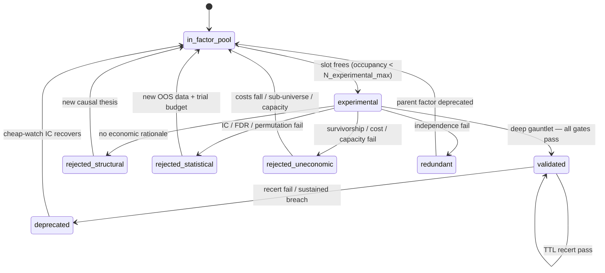
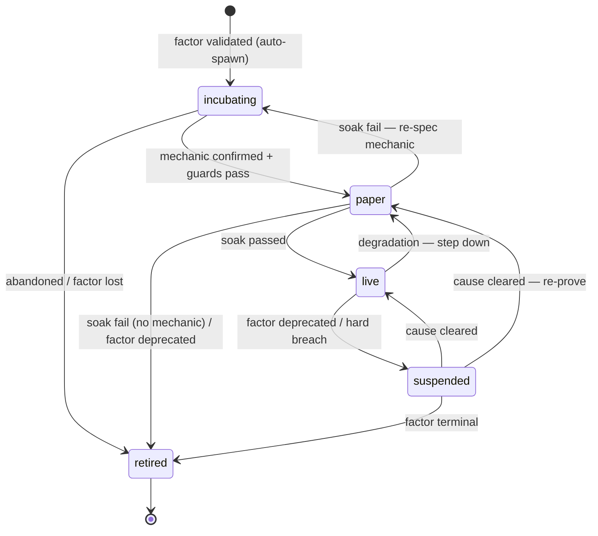

# Factor & Strategy Lifecycle — State-Transition Specification

*Companion to the Strawberry Labs whitepaper (§5.8). The whitepaper names the two
lifecycles; this document defines their states, the trigger and guard on every edge,
and the cascade rules that bind them together.*

> **Reading convention.** A **trigger** is the event that *offers* a transition.
> A **guard** is the condition that must hold for the transition to *fire*; if the guard
> fails, the state is unchanged. Every guard is **fail-closed**: when it cannot be
> evaluated, the answer is *no transition*. Numeric thresholds live in §5 and are marked
> *(ratify)* where the whitepaper does not already fix them.

---

## 1. Factor lifecycle

### 1.1 States

| State | Meaning | Cost of being here |
| --- | --- | --- |
| `in_factor_pool` | Registered candidate, **unworked**. Default entry state. Unbounded backlog; no testing capacity spent until pulled into `experimental`. | **None** — not computed or monitored nightly |
| `experimental` | Candidate **under active research**. Occupies one of `N_experimental_max` work slots; eligible to attempt promotion. | Nightly factor-compute + screening |
| `validated` | Passed the full deep gauntlet. Eligible to back a strategy. Carries a recertification TTL. | Cheap nightly IC/IR watch; deep run only at recert or breach |
| `deprecated` | Was validated; decayed or breached. Sunset, but cheaply watched for revival. | Nightly IC watch only |
| `rejected_structural` | Failed the economic-rationale gate — no causal story. Effectively permanent. | None (archived) |
| `rejected_statistical` | Failed IC / multiple-testing / permutation. Re-testable on genuinely new evidence. | None until cooldown elapses |
| `rejected_uneconomic` | Real edge, but failed survivorship / cost / capacity. Revivable if economics change. | None until trigger |
| `redundant` | Failed independence — a validated factor in disguise. Shelved; auto-revivable if its parent is deprecated. | None |

**Crowding is not a state.** It is a *score* carried on a `validated` factor. It never
blocks validation; it gates strategy **go-live** (§4) and contributes to the demotion guard.

**Adding ≠ testing.** `in_factor_pool` separates the cheap act of *registering* a candidate
from the expensive act of *working* it. The pool is unbounded and costless; `experimental`
is a bounded work-in-progress tier of `N_experimental_max` slots. A pool factor is pulled
into `experimental` only when a slot frees — i.e. when another factor **exits** `experimental`
(to a rejected state, or to `validated`). Rejection is the common exit, so in practice the
pool advances each time a factor is rejected.

### 1.2 Diagram



*Revivals return a factor to the **pool**, not straight to `experimental` — they restore
*eligibility*; the slot-free pull (F0) then admits it by priority when capacity allows.*

### 1.3 Edges

| # | Edge | Trigger | Guard (all must hold) |
| --- | --- | --- | --- |
| F0 | `in_factor_pool → experimental` | An `experimental` slot frees (any factor exits `experimental`) | Occupancy < `N_experimental_max` **and** factor is top of the pool by priority **and** (if revived) its revival precondition already holds |
| F1 | `experimental → validated` | Operator **deep** promotion run (~5,000 shuffles). *Never a nightly run.* | Economic rationale present **and** IR > 0.2 **and** BY-adjusted FDR clears **and** deep permutation p < 0.0027 (t > 3.0) **and** survivorship-haircut applied, still clears **and** net-of-cost + capacity clears **and** PBO acceptable + lockbox confirmed **and** decile-monotone **and** independent of the validated set. Crowding **scored** (does not block). |
| F2 | `experimental → rejected_structural` | Gauntlet attempt | Economic-rationale gate fails |
| F3 | `experimental → rejected_statistical` | Gauntlet attempt | Rationale passes; any of IC / FDR / permutation fails |
| F4 | `experimental → rejected_uneconomic` | Gauntlet attempt | Rationale + statistics pass; any of survivorship / cost / capacity fails |
| F5 | `experimental → redundant` | Gauntlet attempt | Independence gate fails (edge evaporates controlling for validated set) |
| F6 | `validated → validated` (recert) | Recert TTL reached (252 md *(ratify)*) | Fresh deep gauntlet re-run passes (same guard as F1) |
| F7 | `validated → deprecated` | Recert TTL fail **or** breach monitor fires | Recert deep run fails **or** 63-md rolling IR < 0.10 *(ratify)* **or** crowding score critical **and** forward IC negative |
| F8 | `rejected_statistical → in_factor_pool` | New-evidence event | ≥ 63 new OOS market-days since last attempt *(ratify; 126 for stricter)* **and** deflated trial budget still admits a clear |
| F9 | `rejected_uneconomic → in_factor_pool` | Cost / universe change | Measured cost drag < edge **or** liquid sub-universe defined **or** capacity ceiling raised |
| F10 | `rejected_structural → in_factor_pool` | New rationale submitted | Operator attaches a *new* causal thesis (manual gate) |
| F11 | `redundant → in_factor_pool` | Parent-factor deprecation (cascade C5) | The validated factor it duplicated is now `deprecated` |
| F12 | `deprecated → in_factor_pool` | Revival watch crosses threshold | Cheap nightly IC > hurdle, sustained ≥ 63 md *(ratify)* |

**Slot accounting.** `experimental` is a WIP-limited tier. Every exit (F1–F5) decrements
occupancy and fires F0 to pull the next pool factor. Revivals (F8–F12) restore a factor to
the **pool** as *eligible*, where it competes for the next free slot by priority — so a
satisfied revival trigger never stalls against a full `experimental` tier. `N_experimental_max`
is budget-derived (§6): it is sized so a full `experimental` + `validated` set still clears
the nightly goal.

**Re-entry is never a free pass.** A factor pulled back into `experimental` re-runs the
full gauntlet (F1) and **carries the cumulative trial count forward**, so the Deflated
Sharpe bar rises with each attempt. This is the structural defense against "test until it passes."

---

## 2. Strategy lifecycle

### 2.1 States

| State | Meaning |
| --- | --- |
| `incubating` | Stub auto-spawned on factor validation. Mechanic being selected/swept. Not trading. |
| `paper` | Trading in the paper account; accruing attributed soak evidence. |
| `live` | Real capital. |
| `suspended` | Halted (no new orders / flattened) pending an operator decision. Reversible. |
| `retired` | Terminal. Sunset and archived. |

### 2.2 Diagram



### 2.3 Edges

| # | Edge | Trigger | Guard (all must hold) |
| --- | --- | --- | --- |
| S0 | `∅ → incubating` | Factor `validated` event (cascade C1) | None — auto-spawn one default stub on the canonical mechanic |
| S1 | `incubating → paper` | Operator promotion / sweep complete | Factor is `validated` **and** mechanic lockbox-confirmed (sweep ran under the overfitting budget; chosen config clears the held-out lockbox) **and** portfolio compliant-by-construction **and** net-of-cost backtest re-clears **at the mechanic's actual turnover** **and** capacity floor met **and** crowding not critical (or explicitly acknowledged) |
| S2 | `paper → live` | Soak-complete decision | ≥ 63 market-day **attributed** paper soak elapsed **and** realized paper beats the **decay-haircut** backtest (not the raw backtest) **and** reconciliation clean across the soak **and** fail-closed guard tripped no *true* breach **and** factor still `validated` **and** capital slot allocated |
| S3 | `paper → incubating` | Soak underperforms | Realized paper materially below decay-haircut, **but** factor still `validated` → re-spec the mechanic rather than kill |
| S4 | `paper → retired` | Soak fail with no viable mechanic, or factor deprecated | No mechanic variant clears **or** factor left `validated` |
| S5 | `live → paper` | Degradation short of a kill | Live evidence below the live-hold band **but** factor still `validated` → step down to re-prove |
| S6 | `live → suspended` | Factor deprecation (cascade C2) **or** hard live breach | Factor moved to `deprecated` **or** live attribution shows the edge gone / unintended risk dominating **or** repeated fail-closed guard trips |
| S7 | `suspended → live` / `suspended → paper` | Cause cleared | Factor `validated` again **and** breach condition cleared (→ `live` if transient; → `paper` to re-prove if the soak grade lapsed) |
| S8 | `suspended → retired` | Operator decision / factor terminal | Factor in a rejected/deprecated state with no near-term revival |

---

## 3. Cascade rules

The whitepaper's hard rule — *a strategy cannot advance unless its factor is `validated`* —
is enforced two ways: as **event cascades** (below) and as a **standing guard** (every
strategy edge re-checks `factor.state == validated` at evaluation time, fail-closed).

| # | Source event | Effect on dependents |
| --- | --- | --- |
| C1 | Factor → `validated` | Auto-spawn one `incubating` strategy on the canonical mechanic (S0). Operator may fork variants, each its own `incubating` strategy. |
| C2 | Factor → `deprecated` (incl. recert fail mid-soak) | **Circuit breaker.** All strategies on that factor: `live → suspended` (flatten / no new orders), `paper → retired`, `incubating → retired`. |
| C3 | Factor → `deprecated → experimental` (revival) | Strategies stay `suspended`/`retired`. **Nothing auto-promotes.** If the factor re-validates, C1 spawns a *fresh* stub — old live strategies are not silently resurrected. |
| C4 | Factor re-validates after revival | C1 applies (new stub). Any `suspended` strategy may return via S7 only on explicit operator action. |
| C5 | Factor → `deprecated` | Any `redundant` factor that duplicated it becomes eligible to re-enter `experimental` (F11). |

---

## 4. Strategy seed registry & sweep contract

Each strategy is **(validated factor) × (seed mechanic) × (sweep axes under budget) ×
(lockbox confirm)**. The seed is the *literature-canonical* configuration, so the sweep
explores around a defensible point. Every swept config is charged to the overfitting
budget; only the lockbox-confirmed winner may take edge S1.

| Strategy | Phase | Seed mechanic | Sweep axes (varied) | Held fixed |
| --- | --- | --- | --- | --- |
| Cross-sectional momentum (12-1) | 0 | Long top decile, monthly rebalance, 1-month hold, equal-weight | Lookback {6-1, 9-1, 12-1}; skip {0,1}; cut {decile, quintile}; weight {equal, rank, vol-scaled} | Long-only; universe; risk caps |
| Quality / value | 0 | Long top decile on a single fundamental (e.g. gross profitability / earnings yield), monthly | Metric; single vs composite; cut; rebalance freq | Long-only; caps |
| Low-volatility / defensive | 0 | Long bottom-vol decile (trailing realized vol), monthly | Vol window; vol vs beta definition; cut | Long-only; caps |
| Cross-sectional reversal (5-day) | 1 | Long bottom / short top decile of past-5-day return, weekly | Lookback {3,5,10}d; hold; long-only vs L/S | Caps |
| Sector / country rotation | 1 | Rank ETFs by momentum, hold top-N, monthly | Lookback; N; weight {equal, rank} | ETF universe; caps |
| Time-series momentum (trend) | 1 | Per-instrument: long if trailing return > 0, else flat | Lookback; MA-filter window; vol-target on/off | Caps |
| Long/short experiment | 1 | Dollar-neutral top-minus-bottom decile on validated momentum | Gross exposure; cut; dollar- vs beta-neutral | Market-neutral caps |

**Sweep discipline.** The number of swept configurations is the trial count fed to the
Deflated Sharpe deflation (§5). A wide sweep raises the bar the winner must clear — so
breadth of search is not free, and the budget is declared *before* the sweep runs.

---

## 5. Parameters (defaults to ratify)

| Parameter | Default | Source |
| --- | --- | --- |
| Promotion IR hurdle | \|IR\| > 0.2 | Whitepaper §5.1 |
| Promotion permutation | deep ~5,000 shuffles, p < 0.0027 (t > 3.0) | Whitepaper §5.2–5.3 |
| FDR correction | Benjamini–Yekutieli (dependence-robust) | Whitepaper §5.2 |
| Survivorship haircut | subtract measured gap (≈ −0.035 momentum) | Whitepaper §5.4 |
| Demotion IR band (hysteresis) | 63-md rolling IR < 0.10 | *Ratify* |
| Recert TTL | 252 market-days (annual) | *Ratify* |
| Statistical-reject cooldown | ≥ 63 new OOS md (126 stricter) | *Ratify* |
| Deprecated-revival window | IC > hurdle sustained ≥ 63 md | *Ratify* |
| Paper soak | ≥ 63 attributed market-days | Whitepaper §6 |
| Paper→live benchmark | beat decay-haircut backtest, not raw | Whitepaper §6 |
| Trial deflation | Deflated Sharpe on cumulative trial count | Whitepaper §5.6 |
| Experimental WIP cap `N_experimental_max` | budget-derived (§6) | *Ratify* |

*The demotion band sits deliberately below the 0.2 promotion hurdle: the gap is the
hysteresis that stops a factor flapping `validated ⇄ deprecated` on noisy nightly data.*

---

## 6. Nightly time budget & research scheduling

The governing operational constraint is wall-clock, not statistics. The nightly run targets
a **10-hour goal**, with a **2-hour spike buffer** reserved on top — a **12-hour hard
ceiling**. Admission budgets research to the 10h goal; the 2h buffer absorbs estimation error
and slow nights before the hard ceiling is ever in play. This section defines how sweep
breadth and factor throughput are derived from that budget rather than hand-set.

### 6.1 Two budgets, not one

| Class | Jobs | Deadline | Elastic? |
| --- | --- | --- | --- |
| **Mandatory** | acquire → validate → model → factor-compute → portfolio → risk caps → order gen → fail-closed guard | hard (before the open) | no — runs to completion |
| **Monitoring** | nightly IC + 100-shuffle check on the `validated` set | near-hard (breach detection) | scales with `N_validated` |
| **Research** | sweep config evaluations · checkpointed deep promotion runs · experimental intake screening | none | yes — spills across nights |

Promotion is a **research** job, not a monitoring job (whitepaper §5.8). A deep
~5,000-shuffle gauntlet is ~50× a nightly check and is **checkpointable**: accumulate
shuffles across nights rather than running one attempt to completion in a single window.
Consequence: deep runs and wide sweeps never threaten the deadline — they consume *nights*,
not *hours-per-night*.

### 6.2 The budget equation

```
T_pipeline + T_factor_compute + T_portfolio        (mandatory)
+ N_validated × c_monitor                          (monitoring)
+ R_research                                        (elastic residual)
≤ 10h  goal      ← research admitted only up to this line
+ 2h   spike buffer  → 12h hard ceiling (absorbs overruns; never planned into)
```

The scheduler runs the mandatory DAG to completion, then **greedily fills the residual by
priority** — monitoring → promotion queue → sweep batches → intake — checkpointing
whatever does not finish.

### 6.3 How the levers resolve

- **Validated count is the hard cap.** Each `validated` factor is a *recurring* nightly tax
  (`× c_monitor`, every night until deprecated), so it is the only lever that competes with
  the budget continuously. Cap it tightly — the independence gate (§5.7) already wants a
  small validated set for statistical reasons; the time budget wants the same for
  operational reasons.
- **Sweep breadth is a throughput knob.** Breadth is **declared up front** (this fixes the
  Deflated-Sharpe trial count) and the sweep is checkpointed across nights. Wider sweeps
  clear over more nights; they never force a missed deadline.
  **Deflate by declared breadth, never by completed count** — otherwise truncation becomes a
  way to dodge the overfitting penalty.
- **Experimental intake is a throughput knob.** Pulling a pool factor into `experimental`
  (F0) adds a recurring nightly factor-compute + screening cost, so `N_experimental_max` is a
  second budget cap alongside `N_validated` — both sized so a full work tier still clears the
  10h goal. The pool itself is free overflow: registering candidates costs nothing nightly.

Net: a sweep is a **statistical unit** (declared, deflation-fixed) decoupled from the
**scheduling unit** (a nightly time slice). Breadth and intake set *how fast* research
clears; only `N_validated` sets *how much the budget shrinks every night*.

### 6.4 Cost primitives to instrument (prerequisite)

No breadth or intake number is defensible until these are measured on the production box:

| Primitive | Definition | Scales with |
| --- | --- | --- |
| `c_pipeline` | acquire + validate + model, full universe | universe size |
| `c_factor` | compute all factors across the universe | validated + experimental count |
| `c_monitor` | one factor's nightly IC + 100-shuffle check | — (per factor) |
| `c_backtest` | one swept config evaluation | mechanic turnover, universe |
| `c_deeprun` | one full ~5,000-shuffle gauntlet (confirm checkpointable/parallel) | shuffle count |

Once measured: `nightly_sweep_configs ≈ floor(R_research / c_backtest)`, and any declared
sweep of breadth *B* completes in `≈ B / nightly_sweep_configs` nights.

### 6.5 Parameters (defaults to ratify)

| Parameter | Default | Source |
| --- | --- | --- |
| Nightly goal | 10h (research admitted to here) | Operator |
| Spike buffer | 2h (→ 12h hard ceiling) | Operator |
| Deep-run checkpoint slice | accumulate shuffles across nights | *Ratify* |
| Sweep deflation basis | **declared** breadth, not completed | Whitepaper §5.6 |
| Validated-set cap | small, budget- and independence-bound | *Ratify* |
| Experimental WIP cap | budget-derived, full tier clears 10h goal | *Ratify* |

> **Simpler alternative.** If checkpointing is not worth the engineering yet, the fallback
> is static caps tuned so the 95th-percentile night fits in the 10h goal, accepting that
> research (never mandatory work) is occasionally dropped for the night. Checkpointing is the
> more robust choice for an unattended box with variable nightly load.

---

## 7. Adaptive scheduling — run-time audit & task lifetimes

§6 sized the budget from one-off measurements. This section closes the loop: every run
**audits its own timings**, those feed the **next** night's budget, and each research task
runs on its own **lifetime** rather than nightly. "Nightly" is simply the degenerate case
of a lifetime equal to one market-day.

### 7.1 Run-time audit (rolling cost model)

- Every run appends actual wall-clock **per task** to a persistent audit log (also an
  operator-dashboard surface).
- Per task type τ, maintain a rolling **mean `μ_τ`** (EWMA) and **spread `σ_τ`**. Admission
  budgets against a conservative upper bound **`ĉ_τ = μ_τ + k·σ_τ`** (`k` *ratify*; `k ≈ 2`
  ≈ p95). Budgeting to the mean is unsafe — one slow night eats the slack to the open.
- **Cold start:** seed with conservative constants and a wide margin; narrow as samples accrue.
- **Overrun handling:** `actual > predicted` automatically shrinks the next night's admitted
  research (the EWMA reacts); an explicit penalty term is optional.
- **Mandatory-creep alarm:** if predicted `mandatory + monitoring` approaches the **10h goal**
  (research residual ≈ 0) or begins eating the **2h spike buffer**, the open is at risk →
  operator alert with remediations (shrink the validated set, lower the experimental WIP cap,
  trim the universe, speed the pipeline). This is the validated/experimental tax (§6.3)
  becoming binding, surfaced before it bites.

### 7.2 Task lifetimes

Every task declares a **lifetime** (when its result goes stale and may be recomputed), an
**eligibility mode**, and optional **structural triggers**. **Cadences are clock-based
(market-days) only** — no data-driven drift detection in this version. The only non-clock
triggers are discrete *structural events* (a universe re-baseline, a change to the validated
set), which force-expire a task's clock early; these are operator/config events, not measured
drift.

| Task | Gate | Lifetime *(ratify)* | Mode | Structural trigger |
| --- | --- | --- | --- | --- |
| IC / IR monitor | 5.1 | 1 md | clock | — |
| Nightly permutation (100-shuffle) | 5.3 | 1 md | clock | — |
| Survivorship splice + haircut | 5.4 | 63 md | clock | universe re-baseline (force-expire) |
| Spread / cost estimate | 5.5 | 21 md | clock | — |
| Capacity per name | 5.5 | 21 md | clock | — |
| Crowding (ownership + valuation spread) | 5.7 | 63 md | clock | — |
| Independence re-check | 5.7 | — | event | validated-set mutation |
| FDR / multiple-testing panel | 5.2 | — | on-demand | promotion attempt |
| Deep permutation (~5,000) | 5.3 | — | on-demand (checkpointed) | promotion attempt |
| PBO / lockbox | 5.6 | — | on-demand | promotion attempt / sweep |
| Monotonicity | 5.7 | — | on-demand | promotion attempt |
| Recertification | F6 | 252 md | clock | — |
| Sweep batch | §4 | — | on-demand (checkpointed) | operator sweep |

### 7.3 Admission algorithm (each night)

1. **Predict** `mandatory + monitoring` from the audit (conservative `ĉ`). Residual
   `R = 10h goal − predicted`. The 2h spike buffer is **not** admitted into — it stays free.
2. **Build the eligible queue:** tasks whose lifetime has elapsed **or** whose trigger fired.
3. **Order** by (priority, then **overdue-urgency**). Urgency `= (now − due)/lifetime`, where
   `due = last_run + lifetime`; urgency escalates effective priority so overdue tasks climb.
4. **Admit greedily** by `ĉ` until `R` is exhausted; **checkpoint/defer** the rest — deep runs
   and sweeps resume next night against their declared (deflation-fixed) breadth.
5. **Phase** periodic tasks (stagger their offsets) so heavy jobs (survivorship, crowding,
   recert) do not collide on one night.
6. **Bounded-staleness guarantee:** a task overdue by ≥ 2× its lifetime *(ratify)* preempts
   lower-priority research, so no periodic task can be starved indefinitely.
7. **Record actuals** → update the cost model. Loop.

### 7.4 Evidence freshness (tie-back to the lifecycle)

A `validated` factor's verdict is **fresh** only if every periodic gate beneath it is within
lifetime. Overdue evidence raises an **`evidence-stale`** flag on the factor — *visible, not
auto-demotion* — which recertification (F6) clears. Staleness becomes a surfaced state rather
than silent drift, consistent with the platform's honesty posture.

### 7.5 Parameters (to ratify)

| Parameter | Default | Note |
| --- | --- | --- |
| Conservatism `k` | 2 (≈ p95) | higher = safer, less research admitted |
| Spike buffer | 2h beyond the 10h goal | held free; not admitted into |
| Escalation | urgency-weighted priority | prevents starvation |
| Staleness-preempt multiple | 2× lifetime | hard anti-starvation bound |
| Audit estimator | EWMA mean + spread | per task type; persistent log |
| Lifetimes | see §7.2 registry | **clock-based (market-days) only** |
